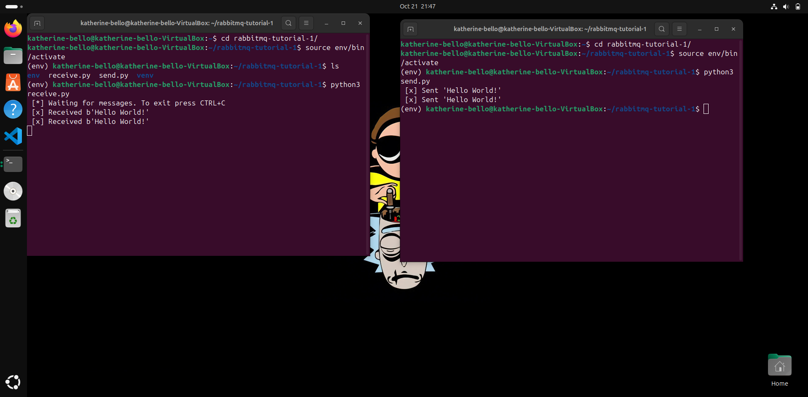
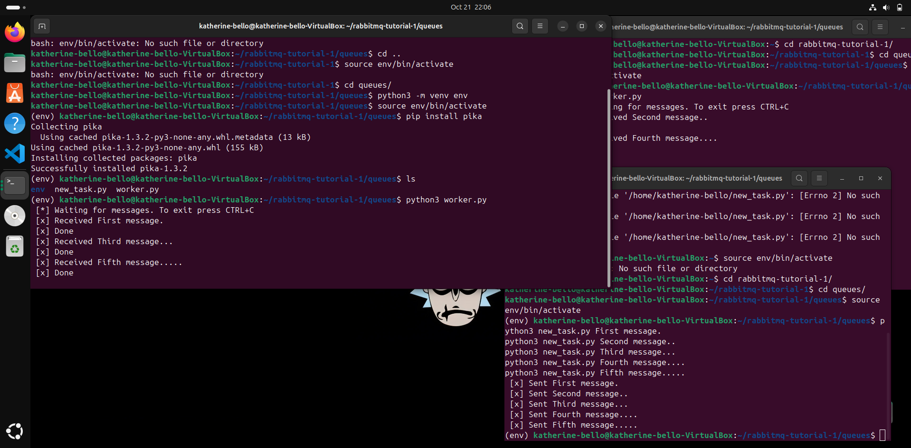
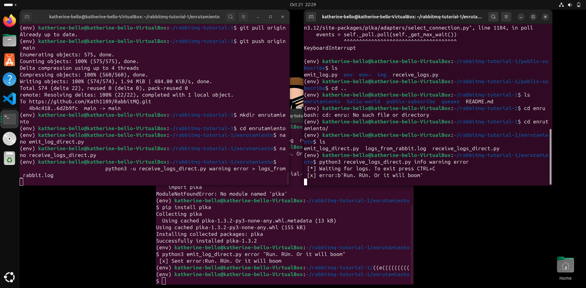

# 🐇 RabbitMQ Tutorials en Python

Este repositorio contiene la implementación paso a paso de los tutoriales oficiales de RabbitMQ usando **Python** y la librería **Pika**.  
Basado en la guía oficial: [RabbitMQ Tutorials](https://www.rabbitmq.com/getstarted.html)

---
1. hello-world

Este primer tutorial enseña los fundamentos básicos de mensajería con RabbitMQ: productor, cola y consumidor. Se envía un mensaje "Hello World!" desde un productor hacia un consumidor a través de la cola hello.

.
Carpeta: hello-world

2. queues

El segundo tutorial aborda cómo enviar múltiples mensajes a una cola y cómo los consumidores los procesan. También se ve la persistencia básica de mensajes.

.
Carpeta: queues

3. publish-subscribe

Este tutorial muestra cómo un mensaje puede ser enviado a múltiples consumidores mediante el patrón de “publicar-suscribir” usando un exchange tipo fanout.

.
Carpeta: publish-subscribe

4. enrutamiento

El cuarto tutorial trata el patrón de enrutamiento (routing) usando exchanges del tipo direct. Se muestran mensajes enrutados a diferentes colas según una “key” de enrutamiento.

.
Carpeta: enrutamiento

